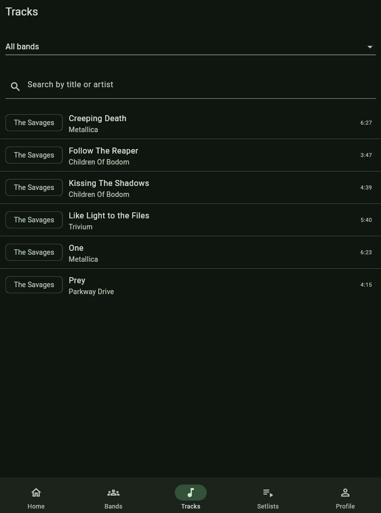
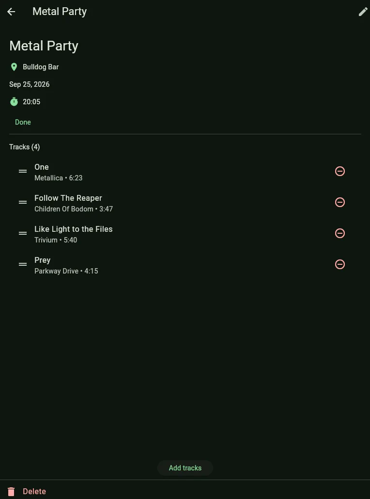
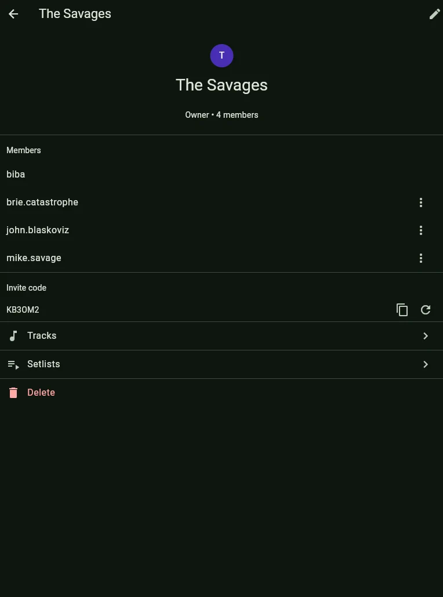
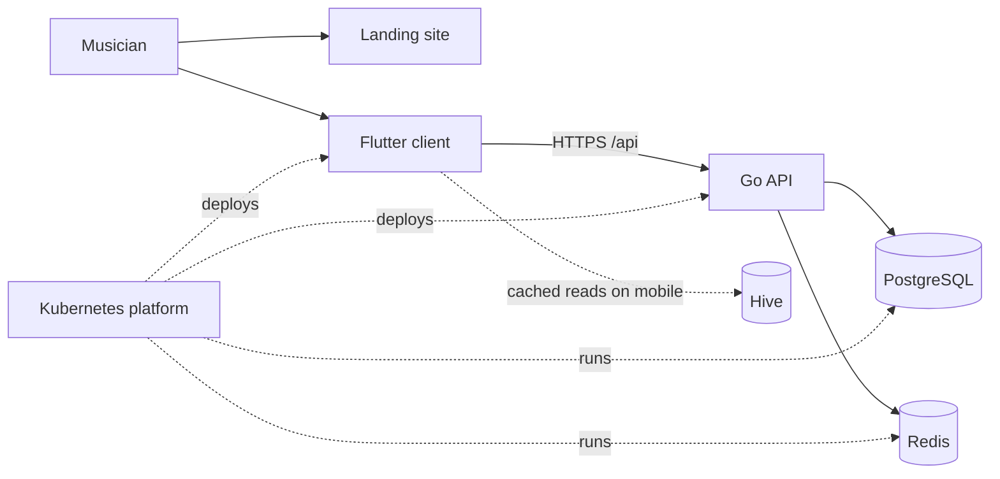

  <strong>A shared repertoire manager for musical bands.</strong> 
  Plan the show, keep every song in reach, and take the setlist on stage.

  <a href="https://cadence.nightnoryu.com/">Website</a> ·
  <a href="https://app.cadence.nightnoryu.com/">Web app</a> ·
  <a href="https://github.com/cadence-muse/client/releases/latest">Android APK</a>

  
  
  
  

Cadence gives a band one place for its members, repertoire, and setlists. Musicians can keep song details such as artist, key,
tempo, duration, and notes together; prepare and reorder setlists; and continue reading previously loaded data when a mobile device loses its connection.

## ✨ Features

- Shared bands with invite codes, membership, and ownership controls
- Searchable repertoires with the details musicians need during rehearsal
- Setlists that can be assembled, reordered, and used at a gig
- A built-in metronome for practice and performance
- English and Russian interfaces with light and dark themes
- Read-only offline access to cached band, track, setlist, and profile data on mobile

## 🖼️ Screenshots

| Repertoire                              | Setlist                           | Band management             |
|-----------------------------------------|-----------------------------------|-----------------------------|
|  |  |  |

## 🧩 Repositories

| Repository                                             | Responsibility                                            | Technology                     |
|--------------------------------------------------------|-----------------------------------------------------------|--------------------------------|
| [`cadence`](https://github.com/cadence-muse/cadence)   | Public API, domain logic, sessions, and persistence       | Go, PostgreSQL, Redis, OpenAPI |
| [`client`](https://github.com/cadence-muse/client)     | Web and Android application with mobile offline cache     | Flutter, Riverpod, Hive        |
| [`landing`](https://github.com/cadence-muse/landing)   | Product website and links to the app and releases         | Hugo, PaperMod                 |
| [`platform`](https://github.com/cadence-muse/platform) | Production workloads, networking, secrets, and deployment | Kubernetes, Kustomize, SOPS    |

## 🏗️ Architecture

The Flutter client is served as a web application and distributed as an Android APK. It calls the same OpenAPI-based
Go service on both platforms. PostgreSQL stores application data, Redis stores sessions, and Hive keeps a read-only
cache on mobile. The production stack runs on Kubernetes behind Traefik; Kustomize assembles the manifests and SOPS protects secrets.

## 🚀 Try Cadence

Open the [web application](https://app.cadence.nightnoryu.com/) or install the [latest Android release](https://github.com/cadence-muse/client/releases/latest).
Development and deployment instructions live in each repository.

## 📜 License

Cadence components are distributed under the [MIT License](https://opensource.org/license/mit).
